[](http://www.itseed.tw)

# 目錄

* 基本介紹
  * [網站架構](#structure)
  * [後台系統](#backend)
* 後台使用教學
  * [文章管理](#cms)
  	* [編輯器](#editor)
  * [報名系統](#enroll)
  	* [系統設定](#setting)
  	* [報名者資料](#applicants)
* 開發者專區
  * [使用語言&工具](#tool)
  * [環境架設](#environment)
  * [伺服器教學](#server)
  * [待解決問題及未開發功能](#issue)

# 基本介紹

<a name="structure"></a>
## 網站架構

* 首頁
* 最新消息
* 關於資種
  * 公會簡介
  * 計畫簡介
  * 歷屆名單
  * 歷屆課程
* 培訓內容
  * 講座課程
  * 企業參訪
  * 專案實作
  * 海外參訪
* 講師介紹
* 經驗分享
* 招生訊息
  * 報名資訊
  * 書審資料
  * 重要時程
  * 常見問題
* 影音專區

<a name="backend"></a>
## 後台系統
* **[系統設定](#setting)**

  報名系統相關設定
  
* **[文章管理](#cms)**
  
  網站內容的管理

* **帳戶管理** ([尚未開發](#issue_1))
  
  使用者管理與權限設定

* **[報名者資料](#applicants)**
  
  當屆報名者個人資料與書審資料

# 後台使用教學

<a name="cms"></a>
## 文章管理
文章管理系統讓管理者不需要修改程式碼就能調整網站內容，可執行的動作包括:

* 新增文章
* 編輯文章
* 刪除文章
* 調整文章順序
* 調整文章狀態
...
#### 介面與基本操作介紹
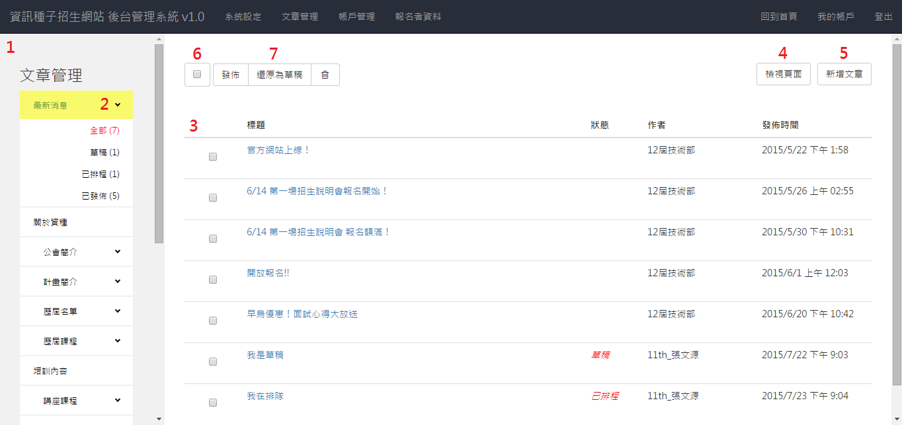

1. 導覽列，根據 [網站架構](#structure) 顯示所有可管理的文章分類
2. 點擊下箭頭展開，會顯示該分類下不同 [狀態](#status) 的文章與其數量
3. 選擇分類與文章的狀態後，列表顯示每篇文章的標題、狀態、作者與發佈時間
   
  * 標題
   
    每篇文章都會有的標題，依據分類的情形，有些會影響網站顯示的內容，有些則不會
   
  * 狀態
   
    每篇文章的狀態
   
  * 作者
  
    新增文章的使用者，而非最後編輯者
   
  * 發佈時間
  
    文章的發佈時間，對沒 [設定發佈時間](#setTime) 的文章來說即是其**第一次** [儲存/發佈](#new)  的時間，若有設定則為其所設定的時間

4. 檢視該分類的網站頁面
5. [新增文章](#editor) 到該分類
6. 勾選方框可以對文章 **進行** / **取消** 全選
7. 可以對於勾選的文章進行 **發佈** / **還原為草稿** / **刪除** 等操作

  
  

8. 鼠標移到文章上時可對該篇文章進行 **編輯** / **檢視** / **預覽** / **刪除** 等操作

  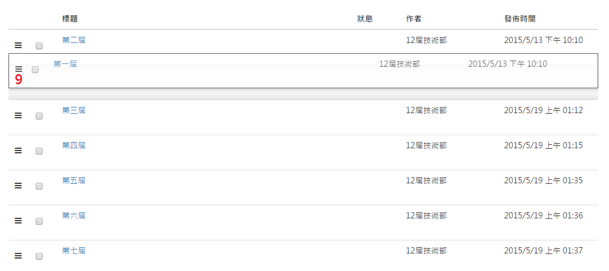

9. 另外，有些分類的文章可以透過 **拖曳圖示** 來進行順序的調整，並依據分類的情形，影響網站顯示的內容

<a name="status"></a>
#### 文章狀態
每篇文章都屬於以下其中一種狀態
* 草稿
* 已發佈
* 已排程

**草稿** 是未完成的文章，不會顯示在網站上

**已發佈** 跟 **已排程** 的文章都是已完成的文章，唯一的差別在於發佈的時間，如果文章的發佈時間設在未來，它就會被加入排程，發佈時間到才會顯示在網站中 (ex: 時間到就自動公佈錄取名單)

文章列表的狀態欄中會以紅字標註出 **草稿** 與 **已排程** 的文章

<a name="editor"></a>
## 編輯器
編輯器是文章管理系統的一部份，管理者可以透過它在線上以視覺化的方式編輯文章的內容

#### 介面


1. 文章標題
2. 文章操作功能
  <a name="new"></a>
  * 新增文章 / 編輯草稿 
   	* 發佈
      
      發佈文章並離開編輯器
   	* 儲存
   		   
      儲存文章為草稿
   	* [預覽](#preview)
   		
      預覽畫面
   	* 關閉
   		
      離開編輯器
  * 編輯已發佈文章 / 編輯已排程文章 
		
    * 還原為草稿
		
      還原文章為草稿 
    * 儲存
   		
      儲存修改的內容
    * 預覽
		
      預覽畫面
    * 關閉
   		
      離開編輯器
3. 編輯器功能
	* 樣式
	* 粗體 斜體 底線 清除格式
	* 字型
	* 字體大小
	* 字體顏色
	* 項目清單 編號清單 段落
	* 行高
	* 表格
	* 連結 圖片 水平線
	* 復原 取消復原 全螢幕 原始碼
	* 幫助

4. 文章編輯區域

5. 文章設定
   依文章分類而有所不同，可進行排程的文章分類會有 [設定日期和時間](#setTime) 的選項

6. 編輯器的擴充功能 
   * Youtube影片
   * [圖片輪播](#slider)
   
#### 詳細功能介紹
<a name="preview"></a>
##### 預覽
編輯器附有預覽文章的功能，使用者可以在發佈前先行預覽文章完成時的畫面

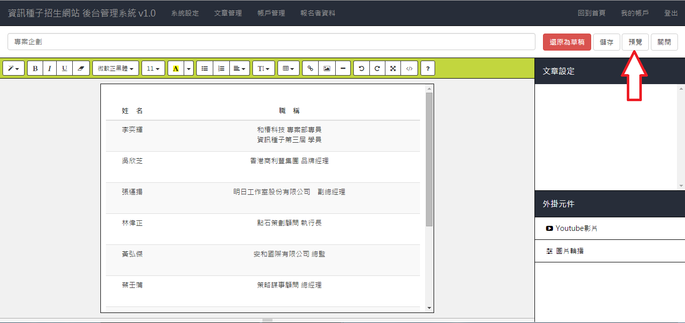

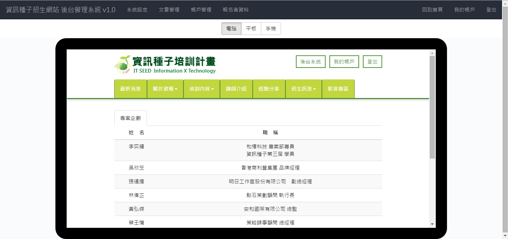

同一篇文章在不同裝置上的呈現可能有所不同，最好在發佈前確認所有情況下的畫面都沒有問題 
[(常見錯誤)](#imgErr)

<a name="setTime"></a>
##### 日期和時間
在某些分類中可以設定文章的發佈時間，如果文章的發佈時間設在未來，它就會被加入排程，發佈時間到才會顯示在網站中

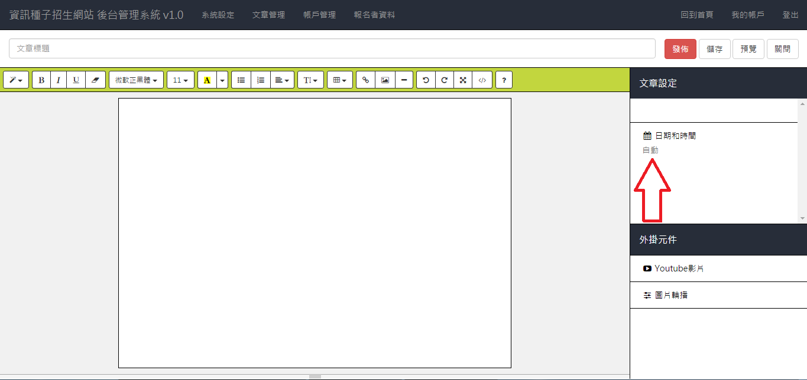
在能設定時間的分類中編輯器會顯示「日期和時間」的欄位，預設為自動

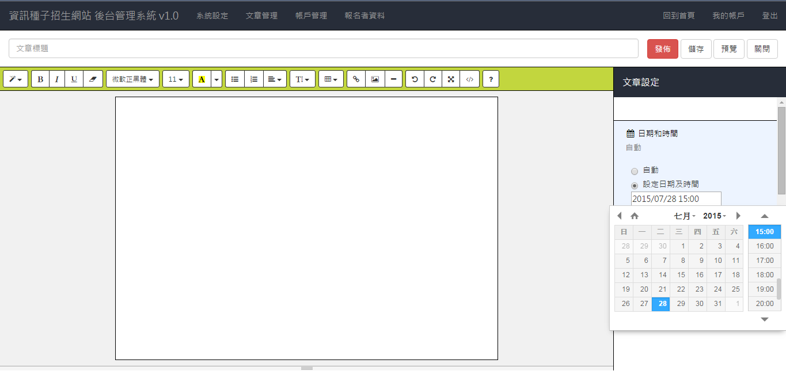
點擊展開後能透過小日曆設定日期及時間

##### 圖片
在文章中能透過三種方式插入圖片

* 第一種是使用編輯器上的圖片按鈕，透過上傳或是圖片網址的方式插入圖片
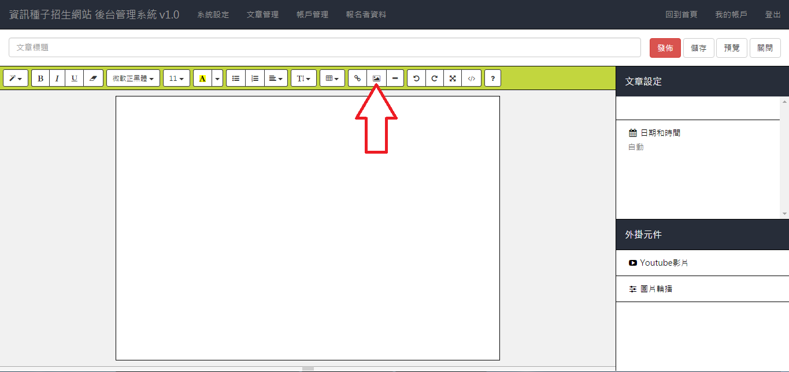
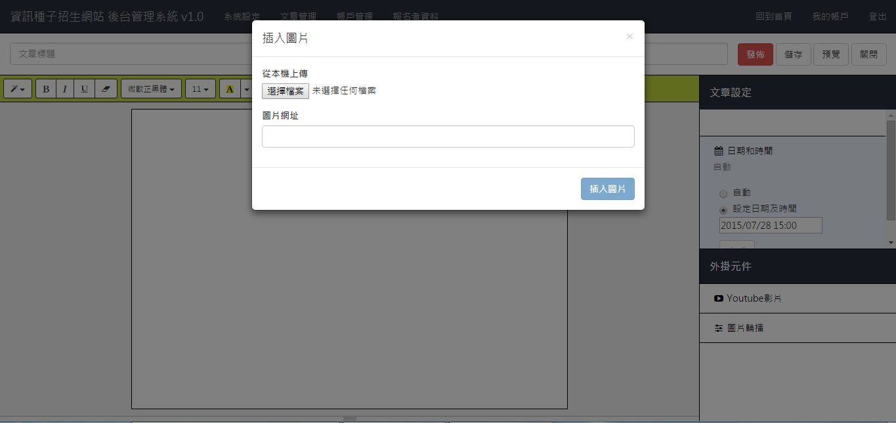

* 第二種方式是從其他網頁或是直接從電腦裡拖拉圖片進編輯區域


* 第三種是直接透過複製貼上的方式插入圖片

圖片插入後，可以透過點擊圖片來叫出圖片的設定選項


另外有一點一定要注意，就是剛插入的圖片寬度是固定的像素，因此當使用手機觀看而圖片寬度過大時，會造成網頁破版的情形
<a name="imgErr"></a>

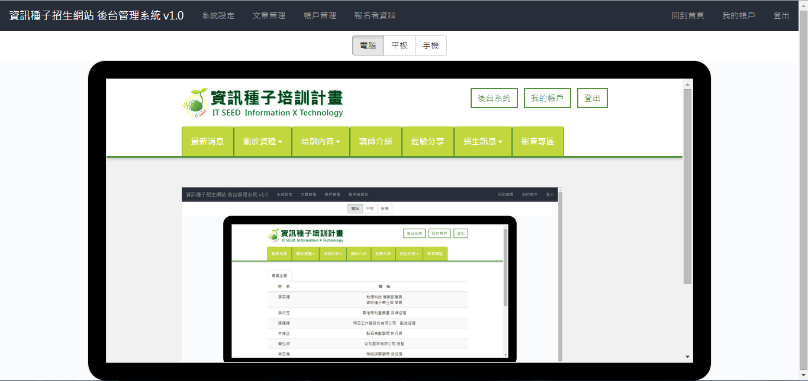
使用電腦觀看時沒有問題


但使用手機觀看時圖片就會把畫面往旁邊撐開

因此建議在每次插入圖片後都把圖片的寬度設為相對於螢幕寬度的百分比，就可避免以上問題
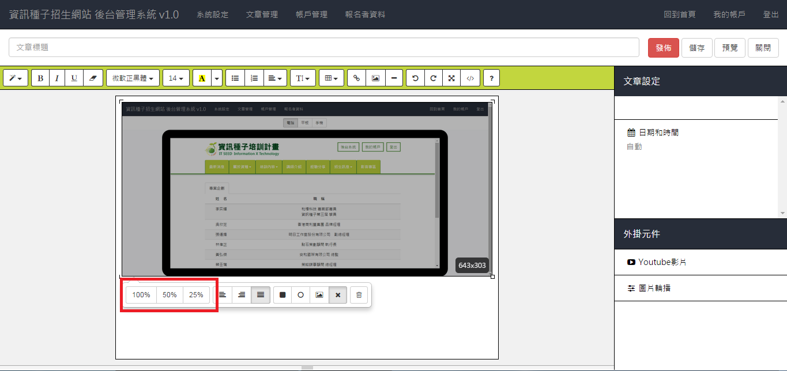

<a name="slider"></a>
##### 圖片輪播
使用圖片輪播的外掛元件，可以在有限區域內展示一組圖片或者照片，同時還有非常吸引人的動畫效果。可執行的動作包括:

* 新增
* 編輯
* 刪除

###### 介面介紹
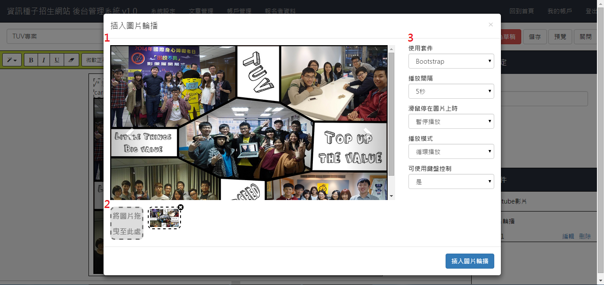

1. 預覽區，圖片輪播會依照圖片與設定進行播放
2. 編輯區，圖片的新增 / 排序 / 刪除都在這裡進行
3. 設定區，圖片輪播的參數可以透過這裡來設定

##### 原始碼
編輯器預設的功能是有限的，但網站的變化可以是無限的，對於有網站前端能力的人來說，可以隨時切換到原始碼模式來進行編輯，做出預設功能裡做不出的效果

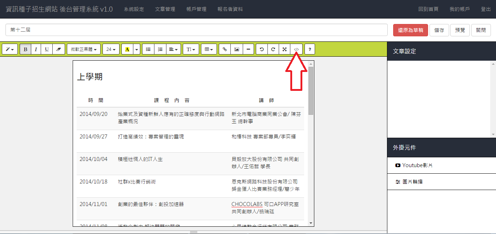

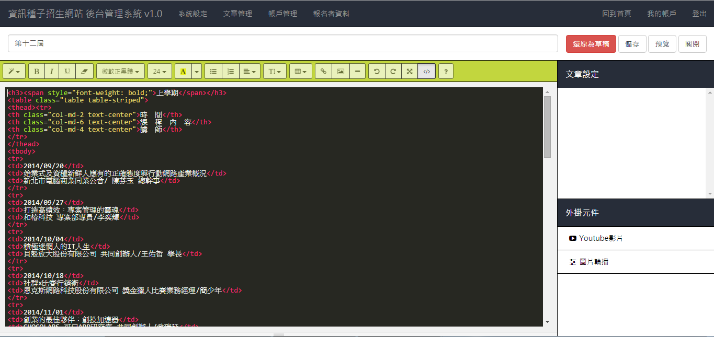

   
<a name="enroll"></a>
## 報名系統
報名系統的後台是網站的核心功能之一，管理者可以在這裡進行系統的設定並觀看報名者的資料

<a name="setting"></a>
#### 系統設定
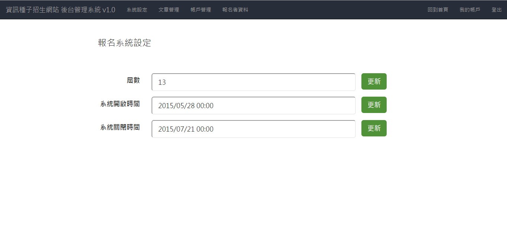

<a name="th"></a>
* 屆數

  報名者的屆數設定，會影響當屆報名者的資料([未解決問題](#issue_2))，以及「報名者資料」顯示的使用者列表

* 系統開放/關閉時間

  影響報名系統的開放期間，在系統關閉期間會關閉以下功能:
	* 新使用者的註冊
	* 報名資料的上傳


<a name="applicants"></a>
#### 報名者資料
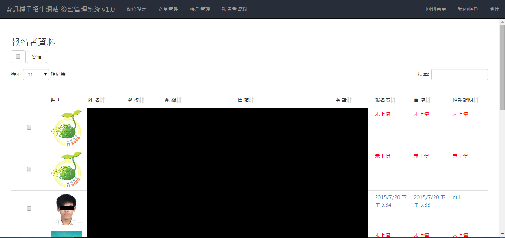

顯示當屆([屆數設定](#th))報名者的重要資訊及其書審資料的繳交情形

* 排序
  
  點擊表頭的圖示可以針對該欄位排序
  
  ex: 針對「報名表」進行排序，可以找出已繳交報名表的報名者

* 篩選
  
  在搜尋框輸入的文字，可以做為報名者的篩選器
  
  ex: 輸入「台灣大學」，可以列出所有學校是台灣大學的報名者
  
* 線上書審
  
  點擊報名表 / 自傳 / 匯款證明欄位中的連結，可以直接開啟上傳的pdf檔進行觀看
  
* 通知信
  
  勾選要發送的對象，在點擊寄信鈕，即可透過Gmail發送通知信給報名者

# 開發者專區

<a name="tool"></a>
## 使用語言&工具
### 前端
* html, css, javascript
* ejs (http://www.embeddedjs.com/)
* less (http://lesscss.org/)
* jQuery (https://jquery.com/)
* Bootstrap (http://getbootstrap.com/)

### 後端
* Node.js (https://nodejs.org/)
* Sails.js (http://sailsjs.org/)

### 版本控制
* git (https://git-scm.com/)
* git-flow (https://github.com/petervanderdoes/gitflow)

<a name="environment"></a>
## 環境架設

1. **安裝 nodeJS**

  http://nodejs.org/

2. **安裝 sails**

  `npm -g install sails`

3. **下載專案**

  `git clone https://github.com/b00705008/itseed.git`

4. **安裝模組**

  `npm install`

5. **開船囉**

  `sails lift`

6. **進入網站**

  [http://localhost:1337/](http://localhost:1337/)

<a name="server"></a>
## 伺服器教學
* **VPS**

  linode (https://www.linode.com/)

* **主機位址**

  `106.187.46.113`

* **帳號密碼**

  請洽
  
  11th 張文源 https://www.facebook.com/casey.chang.106
  
  12th 陳凱鵬 https://www.facebook.com/kk.chen.999

* **儲存庫路徑**

  `/srv/www/itseed.tw/itseed`

### 常用指令
**執行專案**

```
cd /srv/www/itseed.tw/itseed
forever start app.js
```

**停止專案**

```
cd /srv/www/itseed.tw/itseed
forever stop app.js
```

<a name="issue"></a>
## 待解決問題及未開發功能

<a name="issue_1"></a>

* **帳戶管理**

  包括帳戶的權限設定、測試帳戶的刪除、不同屆的帳戶管理等等功能

<a name="issue_2"></a>

* **屆數設定**

  目前的設計是會自動設定當屆新註冊帳號的屆數，報名者無須自行填寫。
  這在一般情形下不會有任何問題，但若報名者隔屆再次使用同一帳號報名時，便會出現問題:
	  
    1. 後台「報名者資料」顯示當屆報名者的清單時不會出現前屆註冊的帳號
	  
    2. 報名者前屆所上傳的資料會被覆蓋，書審時無法作為參考

* **忘記密碼**

  使用者忘記密碼時，重設密碼及發送郵件的功能
	
* **社群登入**

  直接使用FB帳號註冊及登入的功能

* **編輯器外掛元件**

  更多的自訂插件

* **前端優化**

  圖片壓縮、延遲載入...
